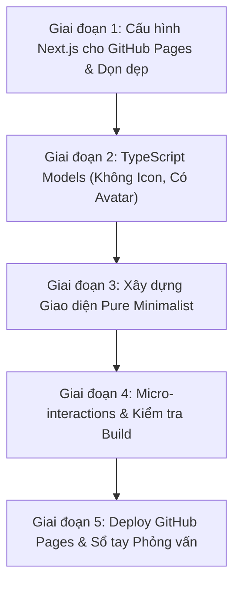

# 🚀 Lộ Trình Xây Dựng Dev Portfolio Chuẩn Xịn (GitHub Pages & Pure Typography)

Tài liệu này đóng vai trò vừa là **kế hoạch dự án (Checklist)**, vừa là **sổ tay học tập (Knowledge Base)** để bạn hiểu sâu lý do tại sao lại chọn kiến trúc và cách viết code này.

---

## 📌 Định Hướng Thiết Kế & Công Nghệ

| Tiêu chí | Quyết định | Giải thích chi tiết |
| :--- | :--- | :--- |
| **Nền tảng Deploy** | **GitHub Pages** | Deploy tự động thông qua GitHub Actions (`.github/workflows/deploy.yml`), xuất static HTML (`output: 'export'`), chạy 24/7 hoàn toàn miễn phí. |
| **Phong cách UI** | **Pure Typographic Minimalist** | **100% KHÔNG ICON, KHÔNG EMOJI**. Thiết kế theo trường phái Brutalist / Editorial tối giản, tập trung vào font chữ sắc nét, đường kẻ viền tinh tế, mã số thứ tự `01/`, nhãn text `[ GitHub ]`, `[ Live Demo ↗ ]`. |
| **Hình ảnh cá nhân** | **Có Avatar** | Khu vực Avatar chuyên nghiệp, đóng khung viền sắc sảo ở phần Hero. |
| **Ngôn ngữ** | **TypeScript (Strict)** | Định nghĩa Type rõ ràng, không dùng `any`, rèn luyện tư duy lập trình vững chắc. |
| **Framework** | **Next.js 16 + Tailwind CSS v4** | Tốc độ load tĩnh tức thì, tối ưu cấu trúc component. |

---

## 🗺️ 5 Giai Đoạn Thực Hiện

---

### 🟢 Giai đoạn 1: Cấu hình Next.js cho GitHub Pages & Dọn dẹp Dự án
> **Mục tiêu**: Chuẩn bị dự án Next.js sẵn sàng xuất static HTML cho GitHub Pages và hiểu rõ các file cấu hình.

- [ ] **1.1. Cấu hình `next.config.ts`**:
  - Bật `output: 'export'` để sinh thư mục `out/`.
  - Cấu hình `images: { unoptimized: true }` cho GitHub Pages.
- [ ] **1.2. Tạo GitHub Actions workflow (`.github/workflows/deploy.yml`)**:
  - Tự động build và deploy lên GitHub Pages mỗi khi push code.
- [ ] **1.3. Cài đặt các package cần thiết**:
  - `next-themes` (Dark/Light mode).
- [ ] **1.4. Góc học tập**:
  - Tại sao Next.js cần `output: 'export'` khi deploy lên GitHub Pages? Khác biệt giữa Static Site Generation (SSG) và Server-Side Rendering (SSR).

---

### 🟢 Giai đoạn 2: Thiết kế Type Models (Không Icon, Có Avatar)
> **Mục tiêu**: Xây dựng cấu trúc dữ liệu chặt chẽ bằng TypeScript trước khi làm giao diện.

- [ ] **2.1. Tạo `types/portfolio.ts`**:
  - Định nghĩa Type: `Profile` (có `avatarUrl`), `Project`, `Skill`, `Experience`, `SocialLink` (100% không có icon).
- [ ] **2.2. Tạo `data/portfolio-data.ts`**:
  - Nơi duy nhất lưu toàn bộ dữ liệu portfolio của bạn.
- [ ] **2.3. Chuẩn bị ảnh Avatar**:
  - Đặt ảnh avatar vào thư mục `public/images/avatar.jpg`.
- [ ] **2.4. Góc học tập**:
  - Tìm hiểu `type` vs `interface` và TypeScript Discriminated Unions.

---

### 🟢 Giai đoạn 3: Xây dựng Giao diện Pure Minimalist (Zero Icon, Zero Emoji)
> **Mục tiêu**: Lắp ráp giao diện đậm chất developer, tối giản, thanh lịch, không cần bất kỳ icon hay emoji nào.

- [ ] **3.1. Navbar**:
  - Menu text: `[ INDEX ]`, `[ ABOUT ]`, `[ PROJECTS ]`, `[ EXPERIENCE ]`, `[ CONTACT ]` + Nút chuyển `[ THEME: LIGHT / DARK ]`.
- [ ] **3.2. Hero Section**:
  - Ảnh Avatar bo góc viền kép tinh tế.
  - Tên, tiêu đề chức danh, status pill: `[ STATUS: AVAILABLE FOR WORK ]`.
  - Nút bấm text: `[ VIEW PROJECTS ↓ ]`, `[ RESUME.PDF ]`.
- [ ] **3.3. About & Skills**:
  - Tiểu sử ngắn gọn.
  - Kỹ năng chia theo nhóm dạng bảng text phân cột rõ ràng.
- [ ] **3.4. Projects Grid**:
  - Dự án đánh số `01 // TÊN DỰ ÁN`, `02 // TÊN DỰ ÁN`.
  - Tags công nghệ dạng `[ NEXT.JS ] [ TYPESCRIPT ]`.
  - Nút link: `[ DEMO ↗ ]`, `[ CODE ↗ ]`.
- [ ] **3.5. Experience Timeline**:
  - Dòng thời gian mốc năm dạng text `2024 — PRESENT`.
- [ ] **3.6. Contact & Footer**:
  - Email dạng text to rõ, link mạng xã hội `[ GITHUB ]`, `[ LINKEDIN ]`.
- [ ] **3.7. Góc học tập**:
  - Component architecture, Client vs Server Components.

---

### 🟢 Giai đoạn 4: Tinh chỉnh Hiệu ứng & Kiểm tra Static Build
> **Mục tiêu**: Đảm bảo web responsive mượt mà và lệnh build static thành công 100%.

- [ ] **4.1. Hiệu ứng hover viền tinh tế bằng Tailwind CSS**.
- [ ] **4.2. Kiểm tra `npm run build`** đảm bảo sinh ra thư mục `out/` không một lỗi lầm.

---

### 🟢 Giai đoạn 5: Kích hoạt GitHub Pages & Đẩy code
> **Mục tiêu**: Web chính thức online trên GitHub Pages, link sẵn sàng gắn vào CV.

- [ ] **5.1. Push code lên GitHub**.
- [ ] **5.2. Cấu hình GitHub repository Settings > Pages**.
- [ ] **5.3. Viết README.md và Sổ tay phỏng vấn Portfolio**.

---

## 📝 Nhật Ký Tiến Độ (Progress Log)
* **Khởi tạo dự án Next.js 16 + Tailwind CSS v4 + TypeScript**.
* **Định hình phong cách**: Pure Minimalist Typography (100% không icon, không emoji, có avatar) & Deploy trực tiếp GitHub Pages.
